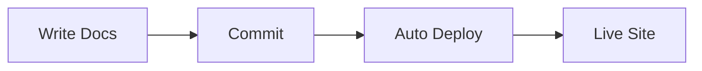
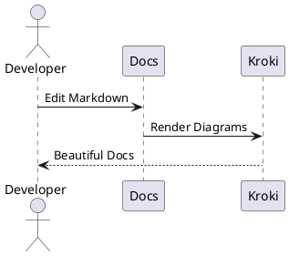

# Documentation Site

A modern documentation site built with **MkDocs Material** and **Kroki** for diagram rendering.

## Features

- 📚 **MkDocs Material** - Beautiful, responsive documentation
- 🎨 **Kroki Integration** - Render Mermaid, PlantUML, and other diagrams
- 🐳 **Docker Compose** - No Python installation required
- 💻 **VS Code Ready** - Preconfigured tasks and extensions
- 🚀 **GitHub Pages** - Automated deployment

## Quick Start

### Development with Docker

1. **Start the development environment:**
   ```bash
   docker compose up
   ```

2. **Access your documentation:**
   - Docs: http://localhost:8080
   - Kroki server: http://localhost:8000

3. **Stop the environment:**
   ```bash
   docker compose down
   ```

### VS Code Integration

Open the project in VS Code and use the preconfigured tasks:
- `Ctrl+Shift+P` → "Tasks: Run Task" → "Dev: up"
- `Ctrl+Shift+P` → "Tasks: Run Task" → "Dev: down"

## Project Structure

```
├── docs/                    # Documentation content
│   ├── index.md            # Homepage
│   ├── getting-started.md  # Getting started guide
│   ├── guides/             # User guides
│   └── diagrams/           # Diagram examples
├── .vscode/                # VS Code configuration
├── .github/workflows/      # GitHub Actions
├── docker-compose.yml      # Docker services
├── mkdocs.yml             # MkDocs configuration
└── requirements.txt       # Python dependencies
```

## Diagram Examples

### Mermaid


### PlantUML


## Building for Production

### Using Docker
```bash
docker run --rm -v $(pwd):/docs squidfunk/mkdocs-material build
```

### Using Python (alternative)
```bash
pip install -r requirements.txt
mkdocs build
```

## Deployment

The site automatically deploys to GitHub Pages when you push to the `main` branch. Make sure to:

1. Enable GitHub Pages in repository settings
2. Set source to "Deploy from a branch"
3. Select `gh-pages` branch

## Contributing

1. Edit Markdown files in the `docs/` directory
2. Use VS Code for the best authoring experience
3. Preview changes with `docker compose up`
4. Commit and push to deploy

## Troubleshooting

### PlantUML JAR File Error

If you see an error like "plantuml.jar file not found", this means VS Code extensions are trying to use a local JAR file instead of the Kroki server.

**Solution**: The project is configured to use Kroki (no JAR needed), but you may need to:

1. **Restart VS Code** after opening the project (to load `.vscode/settings.json`)
2. **Ensure Docker is running** and services are up: `docker compose up`
3. **Check Kroki is accessible**: Visit <http://localhost:8000> in your browser

### Docker WSL Integration Issues

If you get "connect ECONNREFUSED 127.0.0.1:8000":

1. **Enable Docker WSL Integration**:
   - Open Docker Desktop → Settings → Resources → WSL Integration
   - Enable integration with your WSL distro
   - Restart WSL terminal

2. **Alternative**: Use external Kroki service (already configured as fallback)
   - The project will use <https://kroki.io> if local Docker isn't available

The VS Code settings automatically configure:

- PlantUML extension to use Kroki server
- Markdown Preview Enhanced to use Kroki API

### Diagrams Not Rendering

1. **Check services are running**: `docker compose ps`
2. **Verify Kroki health**: `curl http://localhost:8000/health`
3. **Check logs**: `docker compose logs kroki`

### Build Issues

1. **Clear cache**: `docker compose down && docker compose up --build`
2. **Check file permissions**: Ensure Docker can read the `./docs` directory

## Links

- [MkDocs Material Documentation](https://squidfunk.github.io/mkdocs-material/)
- [Kroki Documentation](https://kroki.io/)
- [Mermaid Syntax](https://mermaid.js.org/syntax/flowchart.html)
- [PlantUML Guide](https://plantuml.com/guide)