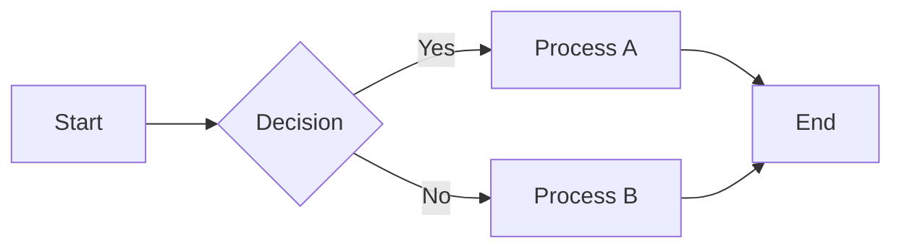
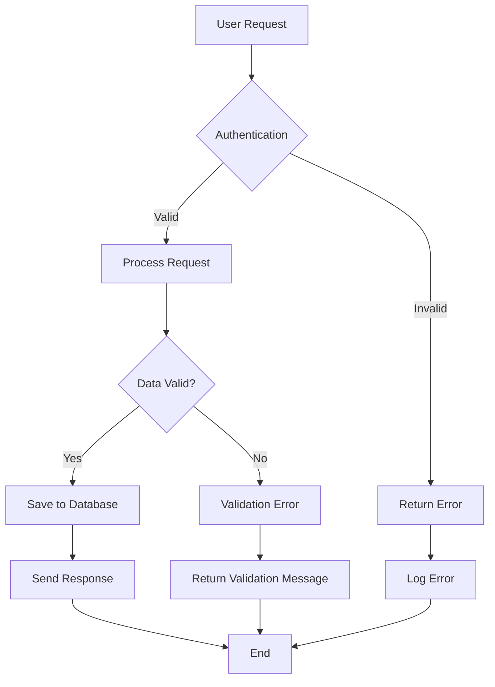
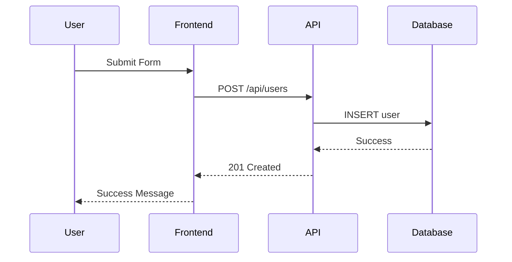
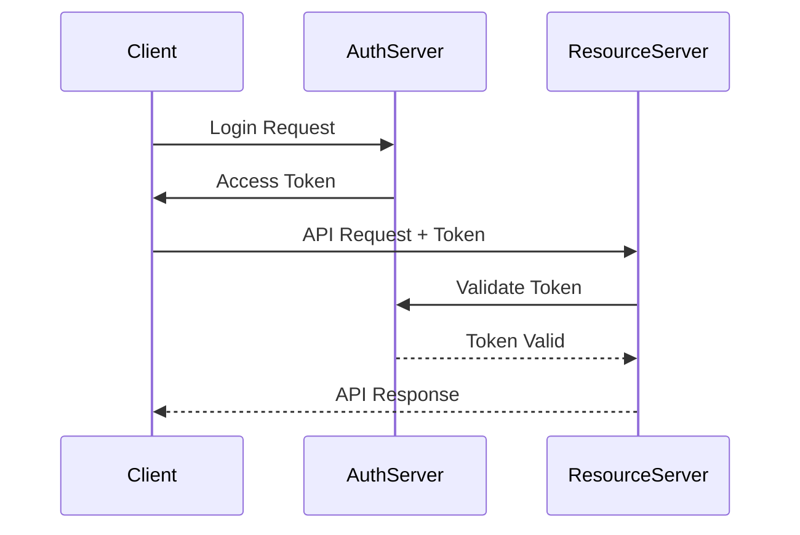
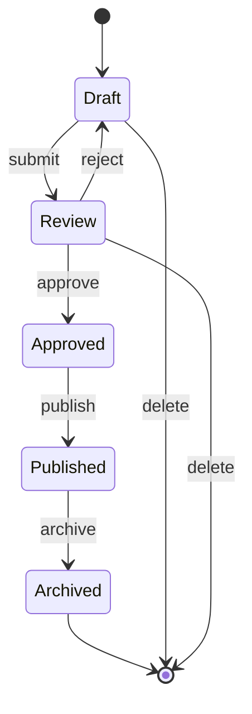
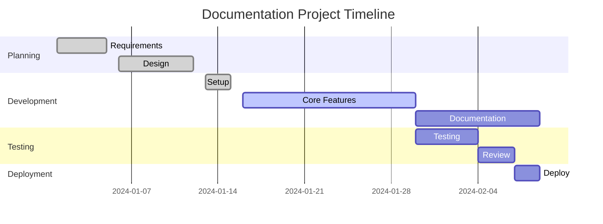
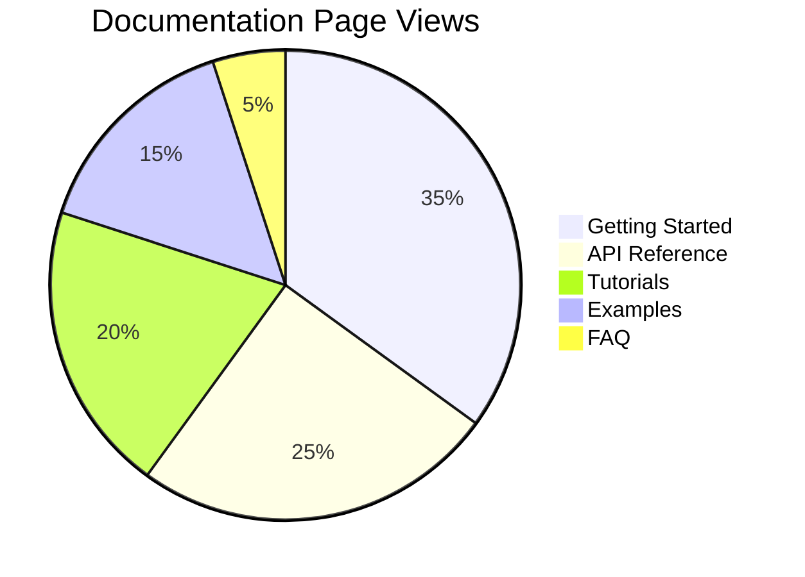
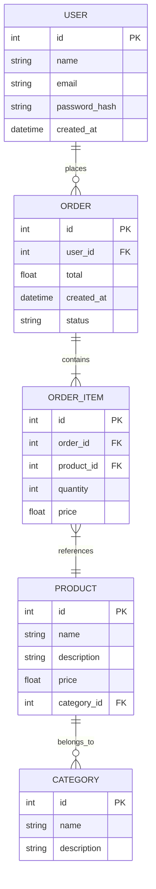
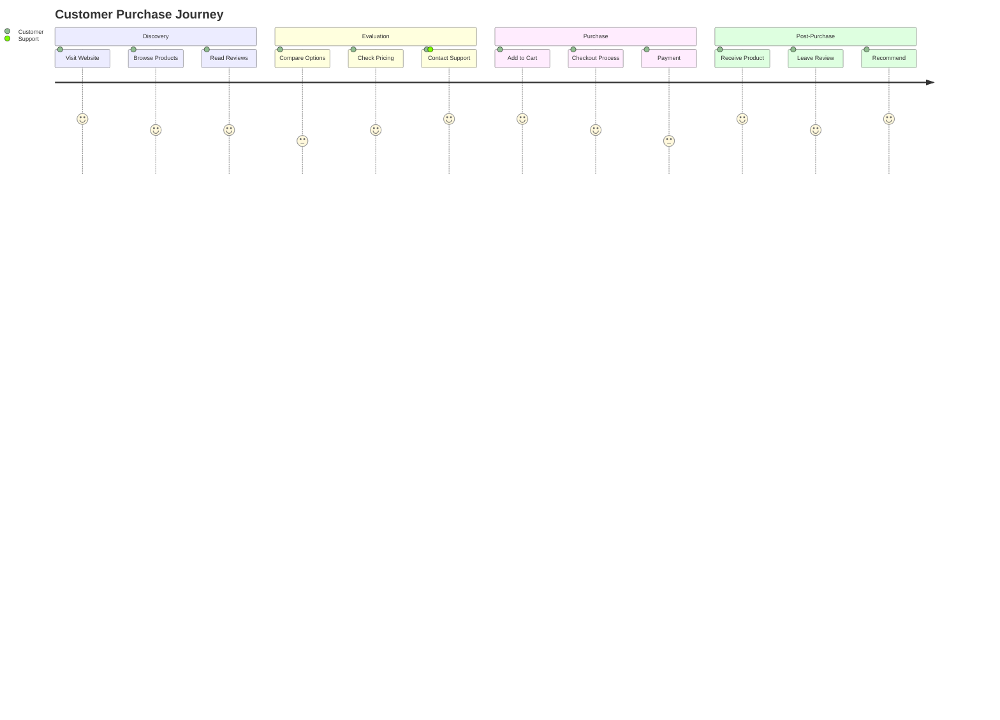
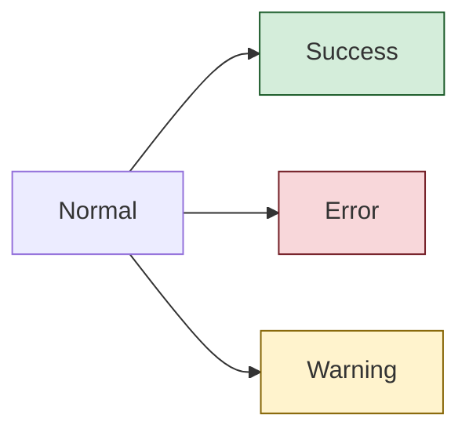

# Mermaid Diagrams

Mermaid is a powerful diagramming tool that uses simple text-based syntax to create beautiful diagrams. This page demonstrates various Mermaid diagram types you can use in your documentation.

## Flowcharts

### Basic Flowchart



### Complex Workflow



## Sequence Diagrams

### API Interaction



### Authentication Flow



## Class Diagrams

### Simple Class Structure

```mermaid
classDiagram
    class User {
        +String name
        +String email
        +String password
        +login()
        +logout()
        +updateProfile()
    }
    
    class Order {
        +String id
        +Date createdAt
        +Float total
        +addItem()
        +removeItem()
        +checkout()
    }
    
    class Product {
        +String name
        +Float price
        +String description
        +updatePrice()
    }
    
    User ||--o{ Order : places
    Order ||--o{ Product : contains
```

## State Diagrams

### Document Workflow



## Gantt Charts

### Project Timeline



## Git Graphs

### Branch Strategy

```mermaid
gitgraph
    commit id: "Initial"
    branch develop
    checkout develop
    commit id: "Setup"
    commit id: "Feature A"
    
    branch feature-b
    checkout feature-b
    commit id: "Feature B"
    
    checkout develop
    merge feature-b
    commit id: "Integration"
    
    checkout main
    merge develop
    commit id: "Release v1.0"
```

## Pie Charts

### Usage Statistics



## Entity Relationship Diagrams

### Database Schema



## User Journey

### Customer Experience



## Syntax Tips

### Basic Elements

- **Rectangles**: `A[Text]`
- **Rounded rectangles**: `A(Text)`  
- **Circles**: `A((Text))`
- **Asymmetric**: `A>Text]`
- **Rhombus**: `A{Text}`
- **Hexagon**: `A{{Text}}`

### Arrows and Links

- **Arrow**: `A --> B`
- **Open link**: `A --- B`
- **Text on link**: `A -->|Text| B`
- **Dotted link**: `A -.-> B`
- **Thick link**: `A ==> B`

### Styling

You can add CSS classes and styles:



## Best Practices

1. **Keep it Simple** - Don't overcomplicate diagrams
2. **Use Clear Labels** - Make node text descriptive
3. **Logical Flow** - Follow natural reading patterns (left-to-right, top-to-bottom)
4. **Consistent Styling** - Use consistent shapes and colors for similar elements
5. **Test Rendering** - Always preview your diagrams to ensure they render correctly

## Resources

- [Mermaid Documentation](https://mermaid.js.org/)
- [Mermaid Live Editor](https://mermaid.live/)
- [Syntax Reference](https://mermaid.js.org/syntax/flowchart.html)
- [Examples Gallery](https://mermaid.js.org/syntax/examples.html)