# PlantUML Diagrams

PlantUML is a versatile tool for creating UML diagrams using simple text descriptions. This page demonstrates various PlantUML diagram types and syntax.

## Sequence Diagrams

### Basic Interaction

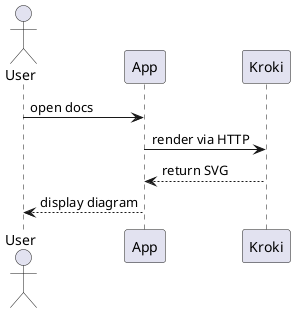

### Complex API Flow

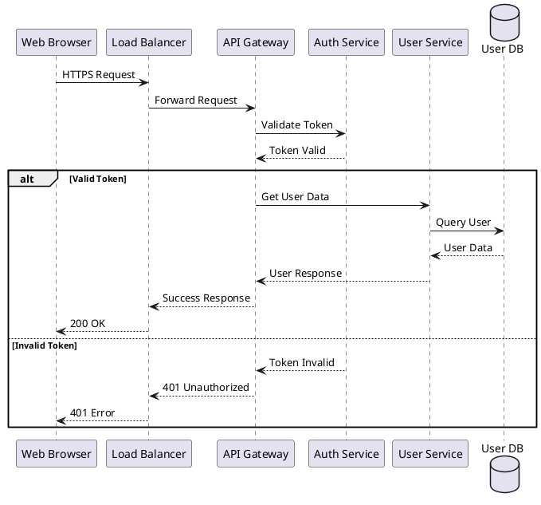

## Class Diagrams

### Basic Class Structure

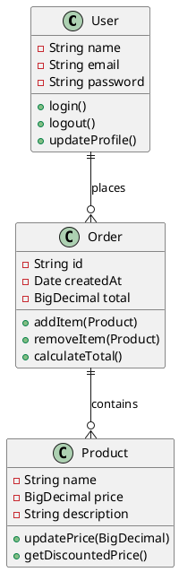

### Advanced Class Relationships

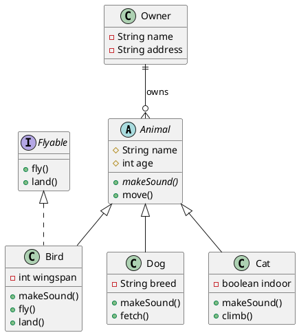

## Use Case Diagrams

### System Overview

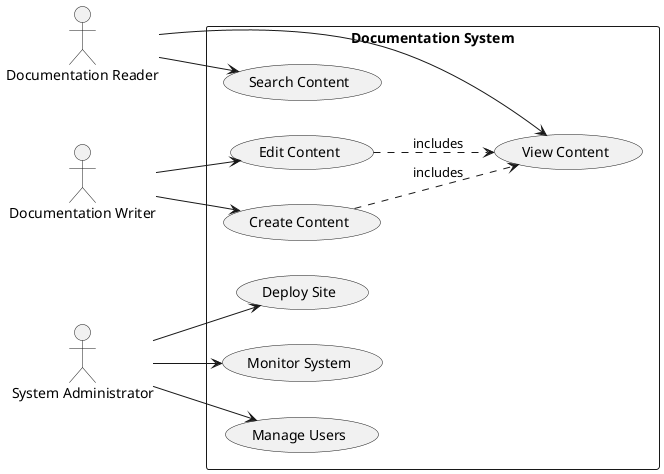

## Activity Diagrams

### Documentation Workflow

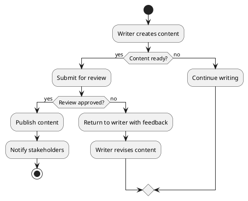

### Deployment Process

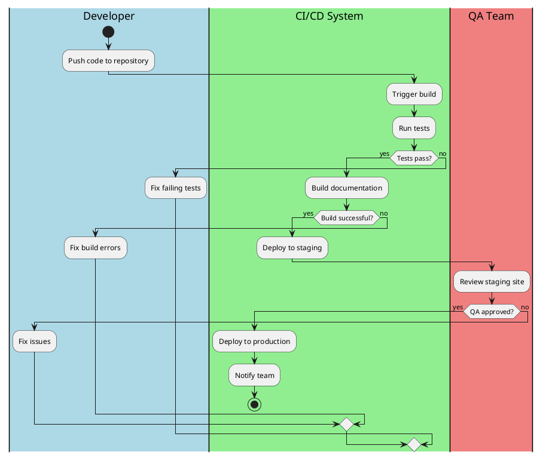

## Component Diagrams

### System Architecture

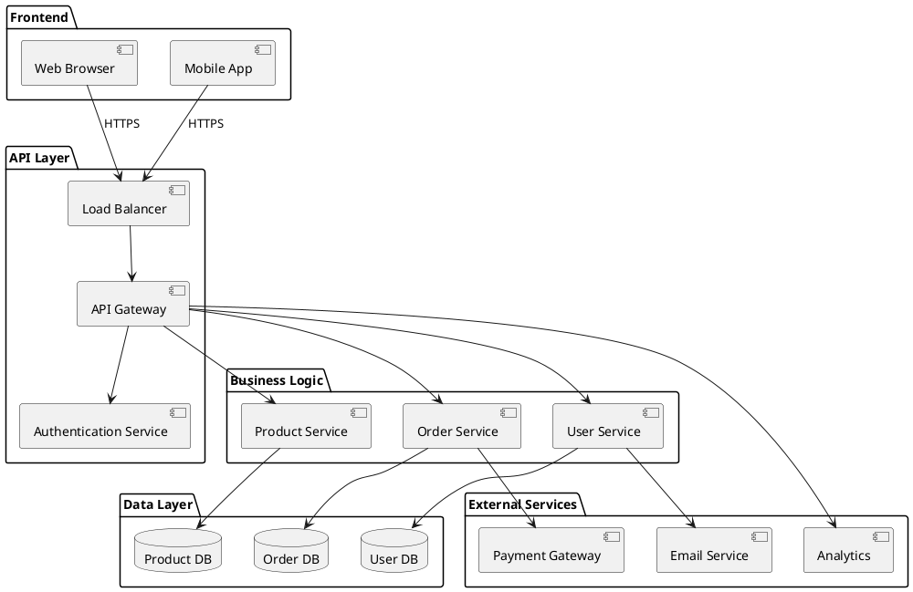

## State Diagrams

### Order State Machine

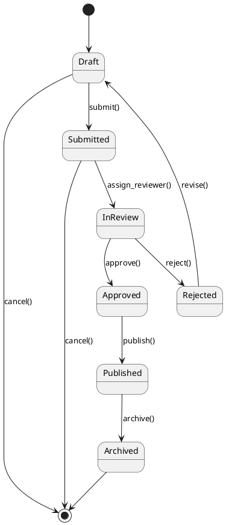

## Deployment Diagrams

### Infrastructure Overview

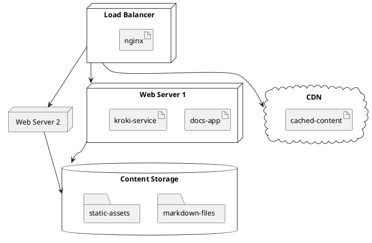

## Timing Diagrams

### Request Processing

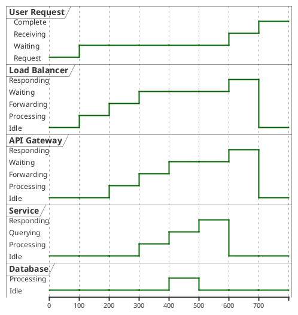

## Network Diagrams

### System Topology

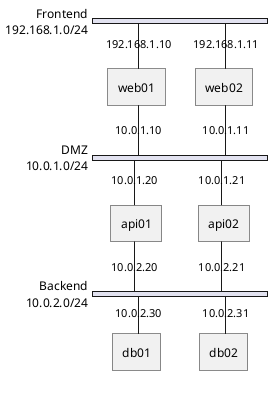

## Syntax Tips

### Basic Elements

- **Actors**: `actor Name` or `participant Name`
- **Arrows**: `A -> B` (solid), `A --> B` (dashed)
- **Self-calls**: `A -> A`
- **Notes**: `note left: Text` or `note right: Text`
- **Activation**: `activate A` / `deactivate A`

### Styling and Colors

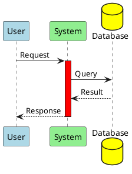

### Grouping and Dividers

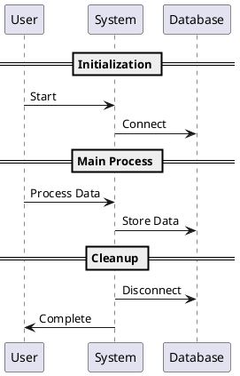

## Best Practices

1. **Use Meaningful Names** - Choose descriptive names for actors and objects
2. **Keep Diagrams Focused** - One concept per diagram
3. **Use Consistent Styling** - Apply consistent colors and formatting
4. **Add Notes** - Explain complex interactions with notes
5. **Group Related Items** - Use packages and groups for organization

## Advanced Features

### Skinparam Customization

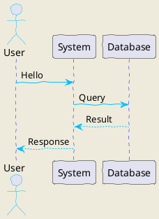

## Resources

- [PlantUML Documentation](https://plantuml.com/)
- [PlantUML Language Reference](https://plantuml.com/guide)
- [Real World PlantUML](https://real-world-plantuml.com/)
- [PlantUML Online Editor](https://www.plantuml.com/plantuml/uml/)