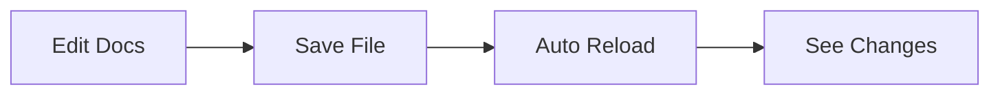
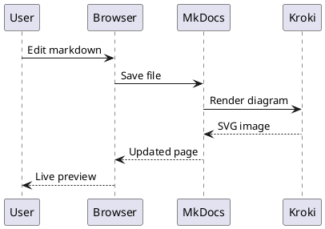

# Getting Started

Learn how to set up and use this documentation platform for writing and maintaining beautiful documentation with diagrams.

## Prerequisites

- **Docker & Docker Compose** - For the development environment
- **VS Code** (recommended) - For the best authoring experience
- **Git** - For version control

## Development Setup

### 1. Clone the Repository

```bash
git clone <your-repo-url>
cd <your-repo-name>
```

### 2. Start the Development Environment

The easiest way to get started is using Docker Compose:

```bash
docker compose up
```

This will start two services:
- **Documentation server** at http://localhost:8080
- **Kroki diagram server** at http://localhost:8000

### 3. VS Code Integration

If you're using VS Code, you'll get:

- **Recommended extensions** automatically suggested
- **Preconfigured tasks** for common operations
- **PlantUML server** integration for diagram previews

#### Available Tasks

Press `Ctrl+Shift+P` and type "Tasks: Run Task" to access:

- **Dev: up** - Start the development environment
- **Dev: down** - Stop the development environment  
- **Build** - Build the site for production
- **Dev: logs** - View development server logs

## File Structure

```
docs/
├── index.md              # Homepage
├── getting-started.md    # This file
├── guides/               # User guides
│   └── authoring.md     # Writing documentation
├── diagrams/             # Diagram examples
│   ├── mermaid.md       # Mermaid examples
│   └── plantuml.md      # PlantUML examples
└── .pages               # Navigation configuration
```

## Writing Documentation

### Basic Markdown

All documentation is written in Markdown. Place your `.md` files in the `docs/` directory and they'll automatically appear in the navigation.

### Live Preview

When the development server is running, changes to Markdown files are automatically reflected in your browser. Just save the file and refresh the page.

### Adding Images

Place images in a subdirectory (e.g., `docs/assets/images/`) and reference them:

```markdown

```

## Creating Diagrams

This platform supports multiple diagram types through Kroki:

### Mermaid Diagrams



### PlantUML Diagrams



## Navigation Structure

Navigation is automatically generated from your folder structure. You can customize it using:

1. **Folder-based navigation** (automatic)
2. **`.pages` files** for custom ordering
3. **`mkdocs.yml`** for manual navigation configuration

## Building for Production

### Using Docker (Recommended)

```bash
docker run --rm -v $(pwd):/docs squidfunk/mkdocs-material build
```

### Using Python

```bash
pip install -r requirements.txt
mkdocs build
```

The built site will be in the `site/` directory.

## Deployment

### GitHub Pages (Automatic)

Push to the `main` branch to automatically deploy to GitHub Pages via GitHub Actions.

### Manual Deployment

Upload the contents of the `site/` directory to any web server.

## Tips for Success

!!! tip "Hot Reload"
    The development server automatically reloads when you save files. Keep your browser open to see changes instantly.

!!! warning "Diagram Server"
    Make sure the Kroki server (port 8000) is running when working with diagrams, or they won't render properly.

!!! info "Extensions"
    Install the recommended VS Code extensions for the best authoring experience, including PlantUML previews and Markdown enhancements.

!!! tip "PlantUML JAR Error"
    If you see "plantuml.jar file not found", restart VS Code to load the project settings that configure extensions to use the Kroki server instead of a local JAR file.

## Next Steps

- Read the [Authoring Guide](guides/authoring.md) for advanced Markdown features
- Explore [Mermaid examples](diagrams/mermaid.md) for flowcharts and graphs  
- Learn [PlantUML syntax](diagrams/plantuml.md) for UML diagrams
- Check out the [MkDocs Material documentation](https://squidfunk.github.io/mkdocs-material/) for advanced configuration